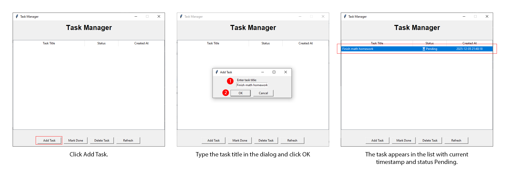
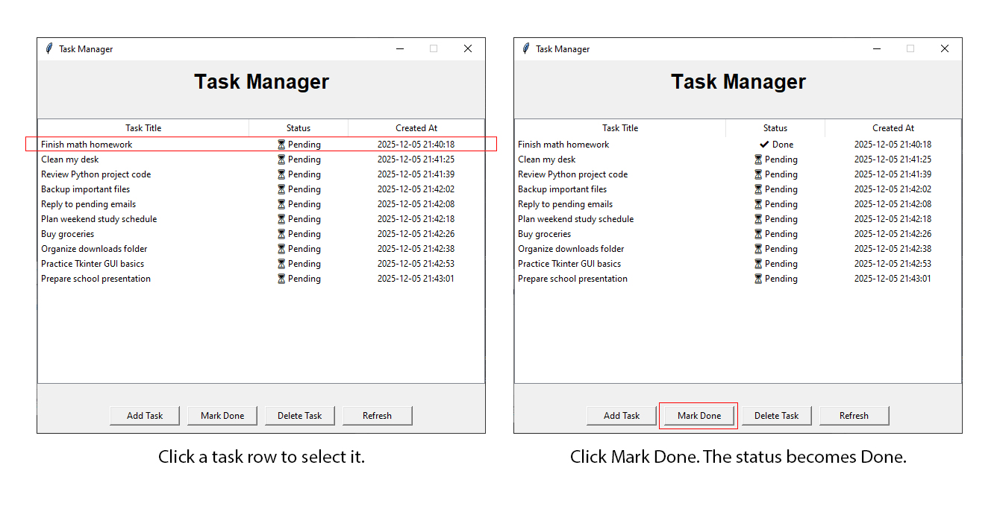
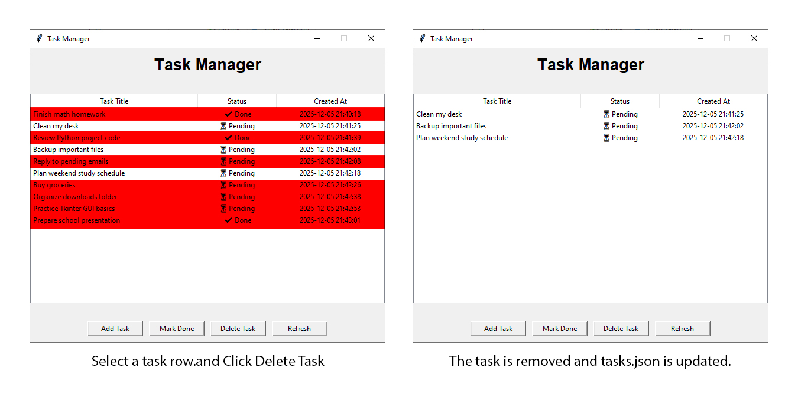
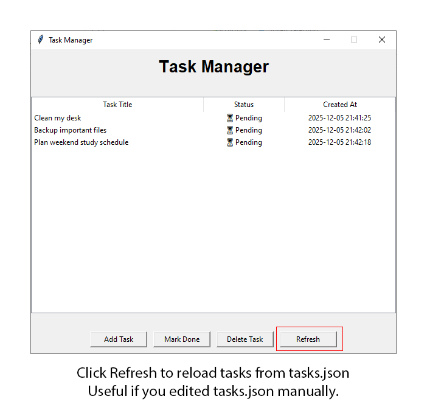

# Task Manager

A clean and simple **Task Manager** built with **Python + Tkinter**, featuring:

- Add, complete, and delete tasks  
- Automatic timestamp tracking  
- JSON-based persistent storage  
- Custom icon (window + taskbar)  
- One-click EXE build (no console window)  

---

## Features

- Easy-to-use GUI  
- Tasks saved automatically in `tasks.json`  
- Custom icon in `assets/task_icon.ico`  
- Fully compatible with PyInstaller  
- Clean project structure for GitHub  

---

## Installation

### Prerequisites

You need **Python 3.12.1** installed on your system.

### Steps

1.  **Clone the repository**
2.  **Install dependencies** using `pip`:

    ```bash
    pip install -r requirements.txt
    ```

### Requirements

This project requires the following Python packages:

* `tk` (Usually included with Python, but listed for completeness)
* `pillow` (For image handling/icon support)

---

## Usage

Run the application task_manager_gui.exe

## Tutorial Screenshots

### Add a Task
[](assets/tutorial_screenshots/images/FAQ_01-add_a_task.jpg)

### Mark a Task as Done
[](assets/tutorial_screenshots/images/FAQ_02-mark_a_task_as_done.jpg)

### Delete a Task
[](assets/tutorial_screenshots/images/FAQ_03-delete_a_task.jpg)

### Refresh
[](assets/tutorial_screenshots/images/FAQ_04-refresh.jpg)